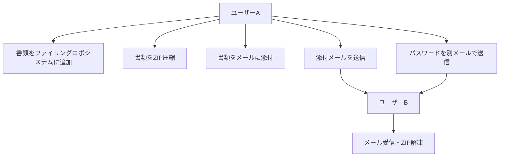
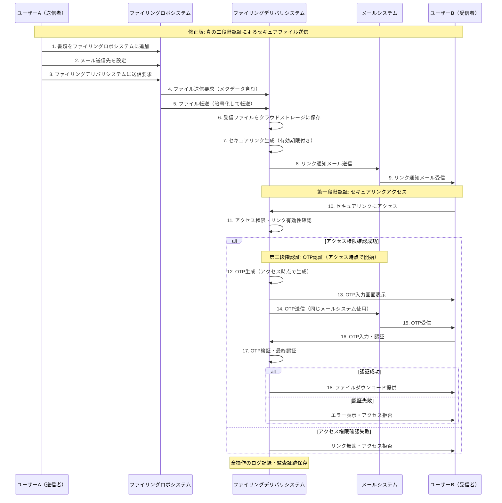
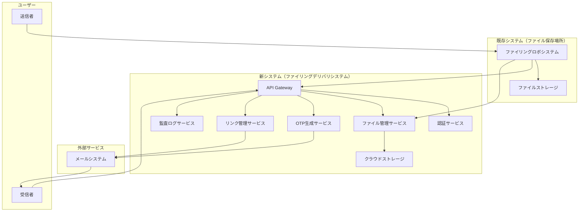

# セキュアファイリングデリバリシステム 要件定義書

## 1. プロジェクト概要

### 1.1 プロジェクト名
secure-mailing-ats（セキュアファイリングデリバリシステム）

### 1.2 プロジェクトの背景
PPAP方式（Password付きZIP、Password別送）の廃止が政府・企業で進む中、クラウドリンク＋OTPによるセキュアな情報伝達システムの構築が急務となっている。ファイリングロボシステムと連携し、より安全で効率的なファイル送信方式への転換を目指す。

## 2. プロジェクト目的

- **必ず実現**
  - PPAP方式に代わるクラウドリンク＋OTPによるセキュアな情報伝達システムを構築する
  - ファイリングロボシステムとの連携による統合ソリューションを提供する
- **できれば実現**
  - ロボシリーズのアドオンとしても使える形でシステムを構築し、商用化の下地を作る

## 3. 現状分析（As-is）

### 3.1 現在のファイル送信フロー

### 3.2 現状の問題点
- **セキュリティリスク**
  - パスワードとファイルが同一経路（メール）で送信される
  - マルウェアの温床となりやすい
  - 暗号化強度が不十分
- **業務効率の問題**
  - 手動でのZIP圧縮・解凍作業
  - パスワード管理の煩雑さ
  - 大容量ファイル送信の制限
- **コンプライアンス問題**
  - 政府機関・企業での廃止が進んでいる
  - 監査ログの不備
  - セキュリティ要件への非対応

## 4. 目指す姿（To-be）

### 4.1 新しいセキュアファイル送信フロー（真の二段階認証）

### 4.2 セキュリティ強化効果
- **真の二段階認証の実現**
  - 第一要素：セキュアリンク（知識要素：メールアクセス）
  - 第二要素：OTP（所有要素：メール受信可能端末）
  - 時間差認証：アクセス時点でのOTP生成による時間的分離
  - アクセス確認成功後のOTP入力画面表示による段階的制御
- **攻撃リスクの大幅軽減**
  - 同時盗聴リスク軽減：異なるタイミングでの認証情報送信
  - 中間者攻撃対策：アクセス時点でのOTP生成により事前取得を防止
  - リプレイ攻撃対策：OTPの短時間有効性（10分）で古い認証情報の無効化
- **エンドツーエンドセキュリティ**
  - ファイル暗号化保存：AES-256による強固な暗号化
  - 通信暗号化：TLS 1.3による安全な通信
  - アクセス制御：IPアドレス・時間帯制限による多層防御

### 4.3 システム改善効果
- **業務効率の向上**
  - 自動化による手作業の削減
  - 大容量ファイル対応（最大10GB）
  - 送信履歴・監査ログの自動記録
- **ユーザビリティの向上**
  - 段階的認証による分かりやすい手順
  - 必要時のみのOTP生成で通知最小化
  - リアルタイムの認証状況確認

## 5. 要件概要

### 5.1 主要機能要件
1. **ファイリングロボシステム連携**
   - 既存システムとの統合インターフェース
   - メタデータの自動連携

2. **ファイリングデリバリシステム**
   - セキュアなファイル保存・管理
   - セキュアリンク生成・管理
   - アクセス時点でのOTP生成機能

3. **真の二段階認証システム**
   - 第一段階：セキュアリンクアクセス認証
   - 第二段階：OTP認証（アクセス時点で生成・送信）
   - 時間差認証による攻撃リスク軽減

4. **監査・ログシステム**
   - 全操作の証跡記録（認証段階別）
   - セキュリティ監視・異常検知
   - 認証失敗パターンの分析

### 5.2 主要非機能要件
- **セキュリティ**: 
  - 暗号化：AES-256（保存時）、TLS 1.3（通信時）
  - 認証：真の二段階認証（時間差OTP生成）
  - アクセス制御：IP制限、時間帯制限、試行回数制限
- **性能**: 
  - レスポンス：リンクアクセス1秒以内、OTP生成・送信5秒以内
  - スループット：1000同時接続対応
  - ファイル処理：10GB対応、1GB/分転送速度
- **可用性**: 99.9%稼働率、4時間以内復旧
- **拡張性**: マイクロサービスアーキテクチャ

### 5.3 制約条件
- 既存ファイリングロボシステムとの互換性維持
- 段階的リリース（12ヶ月開発期間）
- 商用化を見据えた設計

**詳細な要件定義については、[detailed_requirements.md](./detailed_requirements.md)を参照してください。**

## 6. システム構成

### 6.1 システム構成図（修正版）

### 6.2 確定技術スタック

#### 6.2.1 選定結果

| 技術領域 | **確定技術** | **選定理由** |
|---------|-------------|-------------|
| **フロントエンド** | **React + TypeScript** | セキュリティ機能、開発効率、型安全性 |
| **バックエンド** | **Spring Boot** | セキュリティ要件完全対応、OTP認証標準サポート、既存資産活用 |
| **データベース** | **PostgreSQL** | AES-256暗号化標準対応、行レベルセキュリティ、高い同時実行性 |
| **キャッシュ** | **Redis** | OTP管理（TTL機能）、セッション管理、API レート制限 |
| **クラウド** | **AWS** | セキュリティ認証充実、サービス多様性、運用実績 |
| **メッセージング** | **RabbitMQ** | システム要件適合、Spring統合、運用性 |
| **コンテナ** | **Docker + Kubernetes** | 運用効率、セキュリティ分離、AWS統合（EKS） |

#### 6.2.2 主要AWS サービス構成

| 用途 | **AWSサービス** | **適用理由** |
|------|---------------|-------------|
| **コンピューティング** | EKS (Kubernetes) | コンテナ管理、自動スケーリング |
| **ストレージ** | S3 | 大容量ファイル対応（最大10GB）、99.9%可用性 |
| **データベース** | RDS (PostgreSQL) | 管理サービス、自動バックアップ、暗号化 |
| **キャッシュ** | ElastiCache (Redis) | 管理サービス、高可用性、OTP管理 |
| **暗号化** | KMS | 暗号化キー管理、FIPS 140-2準拠 |
| **メール** | SES | OTP配信、高配信率、大量送信対応 |
| **監視** | CloudWatch | 包括的監視、アラート、ログ集約 |
| **セキュリティ** | WAF + GuardDuty | Web保護、脅威検知、セキュリティ監視 |

#### 6.2.3 技術選定の根拠

**詳細な技術選定分析については、[think/technology_stack_analysis.md](./think/technology_stack_analysis.md)を参照してください。**

##### セキュリティ要件への適合性
- **Spring Security**: OAuth2、JWT、OTP認証の標準サポート
- **PostgreSQL**: 透明データ暗号化（TDE）、行レベルセキュリティ（RLS）
- **AWS KMS**: FIPS 140-2 Level 3 HSM対応

##### 性能・スケーラビリティ
- **Spring Boot**: 8,000-12,000 req/sec、大容量ファイル処理
- **PostgreSQL**: MySQL の 2-3倍の書き込み性能
- **Redis**: 100,000+ ops/sec、OTP管理最適化

## 7. エビデンス・参考資料

### 7.1 PPAP方式の問題点に関するエビデンス
1. **政府の対応**
   - 内閣府・内閣官房がPPAP廃止を決定（2020年）
   - デジタル庁設立に伴うセキュリティ強化方針

2. **企業の動向**
   - 大手企業でのPPAP廃止事例多数
   - セキュリティインシデントの増加

3. **技術的根拠**
   - 同一経路での送信によるセキュリティリスク
   - マルウェア検知回避の手段として悪用
   - 暗号化強度の不十分性

### 7.2 代替手段の有効性
1. **クラウドストレージ活用**
   - アクセス制御の柔軟性
   - 監査ログの充実
   - 大容量ファイル対応

2. **S/MIME活用**
   - エンドツーエンド暗号化
   - 電子署名による改ざん検知
   - 標準プロトコルによる互換性

## 8. リスク分析

### 8.1 技術リスク
- **高**: 既存システムとの統合複雑性
- **中**: PostgreSQL移行の複雑性（対策：段階的移行戦略）
- **低**: Redis導入（対策：Blue-Green デプロイメント）
- **低**: 既存技術継続による習得コスト

### 8.2 運用リスク
- **高**: セキュリティインシデント
- **中**: ユーザー受容性
- **低**: 運用コスト増加

### 8.3 事業リスク
- **中**: 競合他社の先行
- **中**: 法規制の変更
- **低**: 市場ニーズの変化

## 9. 成功基準

### 9.1 定量的指標
- セキュリティインシデント: 0件
- ユーザー満足度: 80%以上
- システム稼働率: 99.9%以上

### 9.2 定性的指標
- PPAP代替システムとしての認知
- ロボシリーズアドオンとしての採用

- 商用化への道筋確立

## 10. 開発計画

### 10.1 開発フェーズ（技術移行含む）

#### 技術移行フェーズ（並行実施）
- **PostgreSQL移行**: 2024年12月-2025年2月（2-3ヶ月）
  - データ移行計画策定・実行
  - 段階的移行・並行稼働
- **Redis導入**: 2025年1月（1ヶ月）
  - OTP管理・セッション管理実装
  - Blue-Green デプロイメント
- **Spring Boot強化**: 2025年2月
  - バージョン3.x アップグレード
  - Spring Security 6.x 導入

#### システム開発フェーズ
1. **フェーズ1**: ファイリングデリバリシステム基盤構築（4ヶ月）
   - Spring Boot API Gateway、認証システム
   - PostgreSQL ファイル管理・Redis OTP生成機能
   - React フロントエンド基盤
2. **フェーズ2**: ファイリングロボシステム連携（3ヶ月）
   - 既存システムとのREST API統合
   - React UI/UX実装
   - RabbitMQ メッセージング統合
3. **フェーズ3**: 統合・テスト・商用化準備（2ヶ月）
   - Kubernetes 統合テスト
   - AWS セキュリティサービス統合
   - 商用化準備・運用体制構築

---

**文書作成日**: 2024年12月
**作成者**: プロジェクトチーム
**承認者**: [承認者名]
**次回レビュー予定**: [日付]
