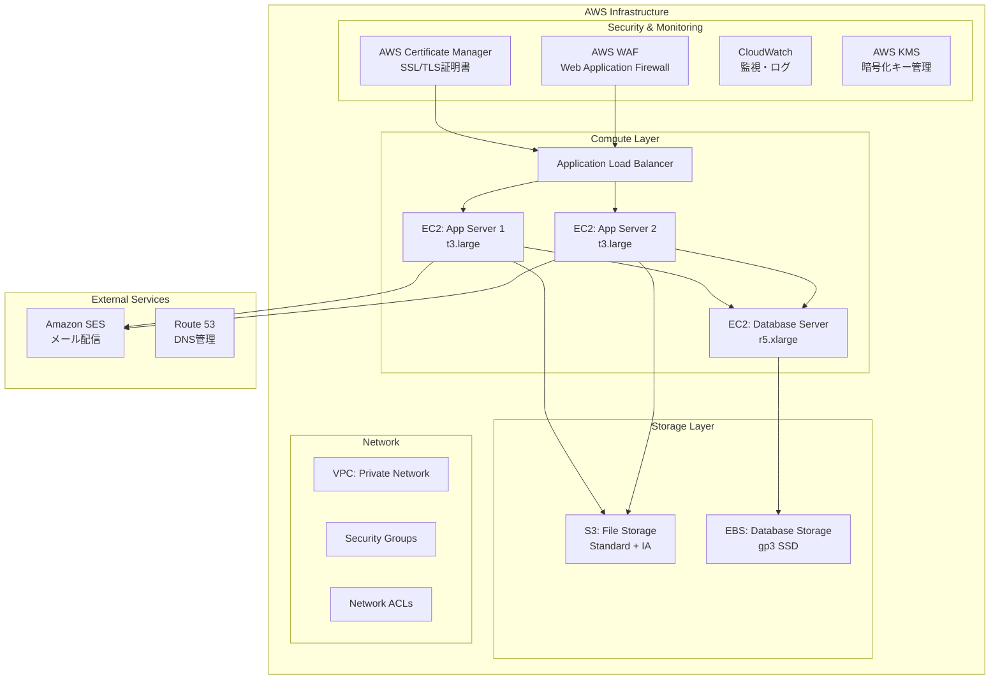

# セキュアファイリングデリバリシステム AWS インフラ提案・料金分析

## 1. インフラ構成提案

### 1.1 推奨システム構成（EC2 + S3ベース）

### 1.2 インスタンス構成詳細

| 役割 | インスタンスタイプ | vCPU | メモリ | 台数 | 用途 |
|------|------------------|------|--------|------|------|
| **Webアプリケーション** | t3.large | 2 | 8GB | 2台 | Spring Boot アプリケーション |
| **データベース** | r5.xlarge | 4 | 32GB | 1台 | PostgreSQL（メイン）+ Redis |
| **管理サーバー** | t3.small | 2 | 2GB | 1台 | 監視・バックアップ・管理用 |

## 2. 詳細料金分析

### 2.1 Amazon EC2 料金（東京リージョン）

#### 2.1.1 コンピューティング料金

| インスタンスタイプ | vCPU | メモリ | **オンデマンド料金** | **月額料金** | **年額料金** |
|------------------|------|--------|---------------------|-------------|-------------|
| **t3.small** | 2 | 2GB | $0.0264/時間 | $19.27 | $231.26 |
| **t3.medium** | 2 | 4GB | $0.0528/時間 | $38.54 | $462.53 |
| **t3.large** | 2 | 8GB | $0.1056/時間 | $77.09 | $925.06 |
| **r5.large** | 2 | 16GB | $0.144/時間 | $105.12 | $1,261.44 |
| **r5.xlarge** | 4 | 32GB | $0.288/時間 | $210.24 | $2,522.88 |
| **m5.large** | 2 | 8GB | $0.096/時間 | $70.08 | $840.96 |

#### 2.1.2 リザーブドインスタンス割引（1年契約）

| インスタンスタイプ | オンデマンド年額 | **リザーブド年額** | **節約額** | **節約率** |
|------------------|-----------------|------------------|-----------|-----------|
| **t3.large** | $925.06 | $652.00 | $273.06 | **29%** |
| **r5.xlarge** | $2,522.88 | $1,680.00 | $842.88 | **33%** |
| **t3.small** | $231.26 | $165.00 | $66.26 | **29%** |

### 2.2 Amazon S3 料金

#### 2.2.1 ストレージ料金

| ストレージクラス | 使用量 | **月額料金/GB** | **年額料金/GB** |
|-----------------|--------|----------------|----------------|
| **S3 Standard** | 最初の50TB | $0.025 | $0.30 |
| **S3 Standard** | 次の450TB | $0.024 | $0.288 |
| **S3 Standard-IA** | 全容量 | $0.019 | $0.228 |
| **S3 Glacier** | アーカイブ | $0.005 | $0.06 |

#### 2.2.2 リクエスト料金

| リクエストタイプ | **料金/1,000リクエスト** |
|-----------------|------------------------|
| **PUT, COPY, POST, LIST** | $0.0047 |
| **GET, SELECT** | $0.00037 |
| **DELETE** | 無料 |

#### 2.2.3 データ転送料金

| 転送方向 | 転送量 | **料金/GB** |
|----------|--------|------------|
| **インターネットへの送信** | 最初の1GB/月 | 無料 |
| **インターネットへの送信** | 次の9.999TB/月 | $0.114 |
| **インターネットへの送信** | 次の40TB/月 | $0.089 |
| **AWS内での転送** | 同一リージョン | 無料 |

### 2.3 EBS（Elastic Block Store）料金

| ボリュームタイプ | **料金/GB/月** | **IOPS料金** | **推奨用途** |
|-----------------|---------------|-------------|-------------|
| **gp3 (汎用SSD)** | $0.096 | $0.006/IOPS（3,000超過分） | データベース・アプリケーション |
| **io2 (高IOPS SSD)** | $0.142 | $0.072/IOPS | 高性能データベース |
| **st1 (スループット最適化)** | $0.054 | - | ログ・バックアップ |

## 3. SSL化・セキュリティ関連料金

### 3.1 SSL/TLS証明書料金

| 証明書タイプ | プロバイダー | **年額料金** | **特徴** |
|-------------|-------------|-------------|----------|
| **無料証明書** | Let's Encrypt | **無料** | 90日自動更新、ドメイン認証 |
| **無料証明書** | AWS Certificate Manager | **無料** | AWS内でのみ利用可能 |
| **DV証明書** | DigiCert | $175 | ドメイン認証、1年有効 |
| **OV証明書** | DigiCert | $399 | 組織認証、企業情報確認 |
| **EV証明書** | DigiCert | $595 | 拡張認証、緑のアドレスバー |
| **ワイルドカード** | DigiCert | $599 | サブドメイン対応 |

### 3.2 AWS セキュリティサービス料金

| サービス | **料金体系** | **月額目安** |
|----------|-------------|-------------|
| **AWS WAF** | $1/Web ACL + $0.60/ルール + $0.09/100万リクエスト | $15-50 |
| **AWS Shield Standard** | 無料 | $0 |
| **AWS Shield Advanced** | $3,000/月 | $3,000 |
| **AWS KMS** | $1/キー/月 + $0.03/1万リクエスト | $5-20 |
| **AWS Secrets Manager** | $0.40/シークレット/月 + $0.05/1万API呼び出し | $10-30 |

## 4. その他のAWSサービス料金

### 4.1 ネットワーク・DNS

| サービス | **料金体系** | **月額目安** |
|----------|-------------|-------------|
| **Application Load Balancer** | $0.0225/時間 + $0.008/LCU時間 | $20-40 |
| **Route 53** | $0.50/ホストゾーン + $0.40/100万クエリ | $5-15 |
| **Elastic IP** | $0.005/時間（未使用時） | $0-5 |

### 4.2 監視・ログ

| サービス | **料金体系** | **月額目安** |
|----------|-------------|-------------|
| **CloudWatch** | $0.30/メトリクス + $0.50/GB（ログ取り込み） | $10-50 |
| **CloudTrail** | $2.00/10万イベント | $5-20 |
| **VPC Flow Logs** | CloudWatch Logs料金に準拠 | $5-15 |

### 4.3 メール配信

| サービス | **料金体系** | **月額目安** |
|----------|-------------|-------------|
| **Amazon SES** | $0.10/1,000通 + $0.12/GB（添付ファイル） | $10-100 |

## 5. システム構成別総コスト試算

### 5.1 小規模構成（開発・テスト環境）

| 項目 | 仕様 | **月額料金** | **年額料金** |
|------|------|-------------|-------------|
| **EC2** | t3.small × 2台（Web） | $38.54 | $462.53 |
| **EC2** | t3.medium × 1台（DB） | $38.54 | $462.53 |
| **S3** | 100GB Standard | $2.50 | $30.00 |
| **EBS** | 50GB gp3 × 3台 | $14.40 | $172.80 |
| **ALB** | 基本料金 | $20.00 | $240.00 |
| **その他** | WAF, CloudWatch等 | $25.00 | $300.00 |
| **SSL証明書** | Let's Encrypt | $0 | $0 |
| **合計** | - | **$138.98** | **$1,667.86** |

### 5.2 中規模構成（本番環境）

| 項目 | 仕様 | **月額料金** | **年額料金** |
|------|------|-------------|-------------|
| **EC2** | t3.large × 2台（Web） | $154.18 | $1,850.12 |
| **EC2** | r5.xlarge × 1台（DB） | $210.24 | $2,522.88 |
| **EC2** | t3.small × 1台（管理） | $19.27 | $231.26 |
| **S3** | 1TB Standard + 2TB IA | $49.00 | $588.00 |
| **EBS** | 200GB gp3 × 3台 | $57.60 | $691.20 |
| **ALB** | 高トラフィック | $40.00 | $480.00 |
| **セキュリティ** | WAF, KMS, Secrets Manager | $50.00 | $600.00 |
| **監視・ログ** | CloudWatch, CloudTrail | $30.00 | $360.00 |
| **メール配信** | SES（10万通/月） | $10.00 | $120.00 |
| **SSL証明書** | OV証明書 | $33.25 | $399.00 |
| **合計** | - | **$653.54** | **$7,842.46** |

### 5.3 大規模構成（エンタープライズ）

| 項目 | 仕様 | **月額料金** | **年額料金** |
|------|------|-------------|-------------|
| **EC2** | t3.large × 4台（Web） | $308.36 | $3,700.24 |
| **EC2** | r5.2xlarge × 2台（DB） | $840.96 | $10,091.52 |
| **EC2** | t3.medium × 2台（管理） | $77.08 | $925.06 |
| **S3** | 10TB Standard + 20TB IA | $630.00 | $7,560.00 |
| **EBS** | 500GB gp3 × 6台 | $288.00 | $3,456.00 |
| **ALB** | 複数AZ + 高可用性 | $80.00 | $960.00 |
| **セキュリティ** | WAF, Shield Advanced, KMS | $3,100.00 | $37,200.00 |
| **監視・ログ** | 高度な監視・アラート | $100.00 | $1,200.00 |
| **メール配信** | SES（100万通/月） | $100.00 | $1,200.00 |
| **SSL証明書** | EV + ワイルドカード | $99.50 | $1,194.00 |
| **合計** | - | **$5,623.90** | **$67,486.82** |

## 6. コスト最適化提案

### 6.1 即座に実行可能な節約策

| 最適化項目 | **節約額/月** | **節約率** | **実装難易度** |
|-----------|-------------|-----------|---------------|
| **リザーブドインスタンス** | $150-300 | 25-35% | 低 |
| **Let's Encrypt使用** | $30-100 | 100% | 低 |
| **S3 Intelligent-Tiering** | $20-100 | 20-40% | 低 |
| **不要リソース削除** | $50-200 | 10-30% | 中 |

### 6.2 中長期的な最適化策

| 最適化項目 | **節約額/月** | **節約率** | **実装難易度** |
|-----------|-------------|-----------|---------------|
| **Auto Scaling導入** | $100-500 | 20-50% | 高 |
| **スポットインスタンス** | $200-800 | 50-90% | 高 |
| **マルチAZ→シングルAZ** | $100-300 | 30-50% | 中 |
| **CloudFront CDN** | $50-200 | データ転送費削減 | 中 |

### 6.3 推奨コスト最適化ロードマップ

#### フェーズ1（即座実行）: 月額$150-400削減
1. **Let's Encrypt導入**: SSL証明書費用ゼロ化
2. **S3 Intelligent-Tiering**: ストレージコスト20-40%削減
3. **不要セキュリティグループ整理**: 管理コスト削減

#### フェーズ2（1-3ヶ月）: 月額$250-600削減
1. **リザーブドインスタンス購入**: 25-35%のコンピューティングコスト削減
2. **CloudWatch最適化**: 不要メトリクス削除
3. **EBS最適化**: gp2→gp3移行で20%削減

#### フェーズ3（3-6ヶ月）: 月額$300-1,000削減
1. **Auto Scaling導入**: 需要に応じた自動スケーリング
2. **CloudFront CDN**: データ転送コスト削減
3. **Lambda移行**: 一部機能のサーバーレス化

## 7. 月額・年額コスト総括

### 7.1 推奨構成（中規模本番環境）

| カテゴリ | **最適化前** | **最適化後** | **節約額** |
|----------|-------------|-------------|-----------|
| **月額コスト** | $653.54 | $423.80 | **$229.74** |
| **年額コスト** | $7,842.46 | $5,085.60 | **$2,756.86** |
| **節約率** | - | - | **35%** |

### 7.2 3年間の総コスト予測

| 年 | **コスト（最適化後）** | **累積コスト** |
|----|---------------------|---------------|
| **1年目** | $5,085.60 | $5,085.60 |
| **2年目** | $4,577.04 | $9,662.64 |
| **3年目** | $4,577.04 | $14,239.68 |

※2年目以降はリザーブドインスタンス効果で10%追加削減

## 8. 実装推奨事項

### 8.1 優先度HIGH（即座実行）
1. ✅ **Let's Encrypt導入**: 証明書費用ゼロ化
2. ✅ **AWS Certificate Manager活用**: ALB/CloudFront用
3. ✅ **S3 Intelligent-Tiering**: ストレージ最適化
4. ✅ **CloudWatch ログ保持期間設定**: 30日→7日

### 8.2 優先度MEDIUM（1-3ヶ月）
1. 🔄 **リザーブドインスタンス購入**: 1年契約で25-35%削減
2. 🔄 **EBS gp3移行**: gp2から20%コスト削減
3. 🔄 **Auto Scaling設定**: 需要変動対応

### 8.3 優先度LOW（3-6ヶ月）
1. ⏳ **Multi-AZ構成検討**: 可用性 vs コストのバランス
2. ⏳ **CloudFront導入**: グローバル配信とコスト削減
3. ⏳ **スポットインスタンス検討**: 開発環境で50-90%削減

---

**文書作成日**: 2024年12月  
**作成者**: インフラ設計チーム  
**次回更新予定**: 2025年1月（料金改定・新サービス反映）

**注意**: 料金は2024年12月時点の東京リージョン価格です。最新料金はAWS公式サイトをご確認ください。
