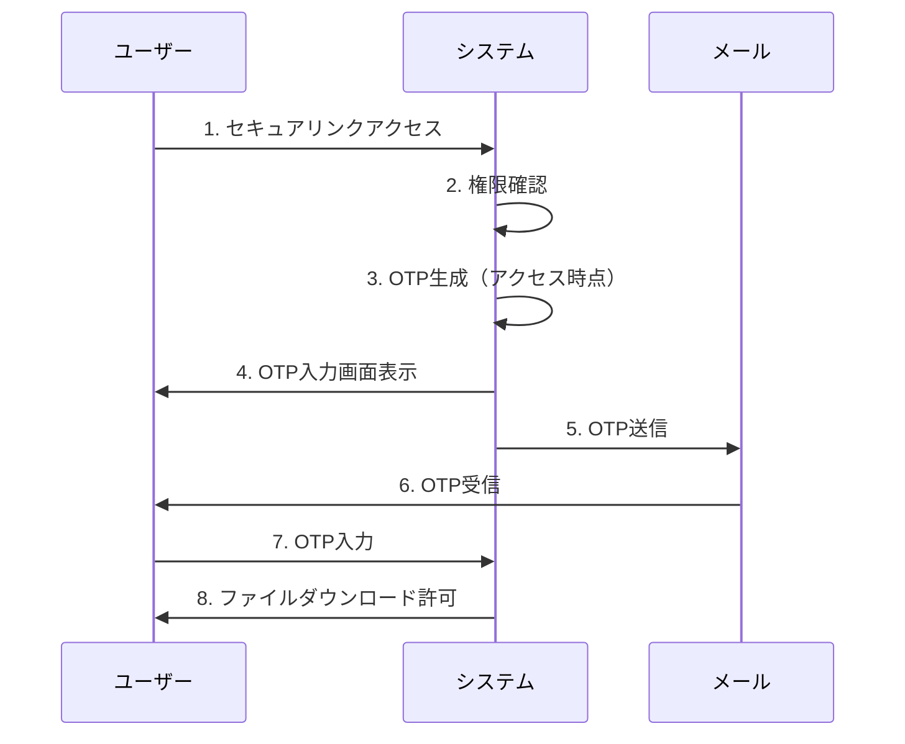
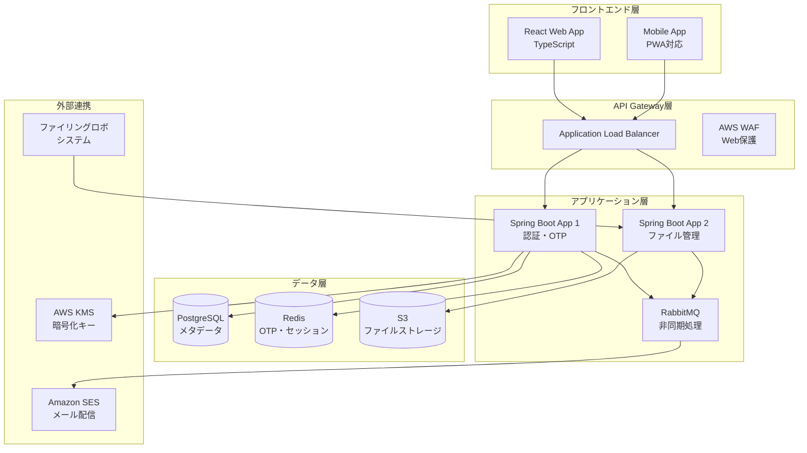
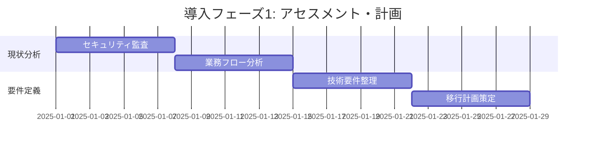
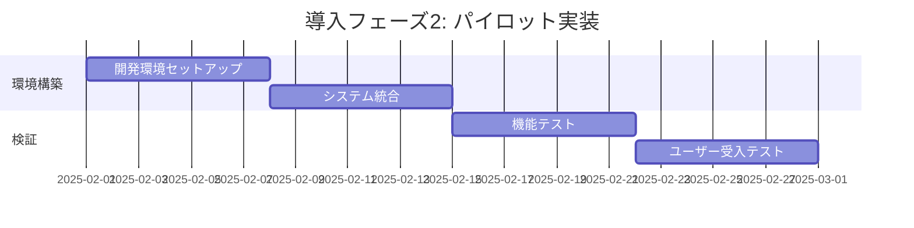
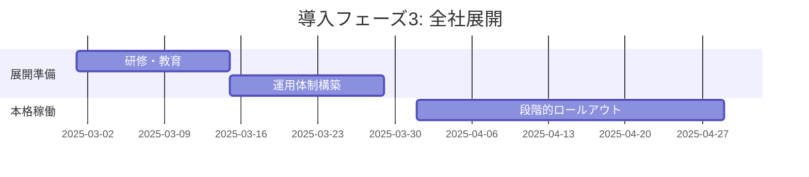
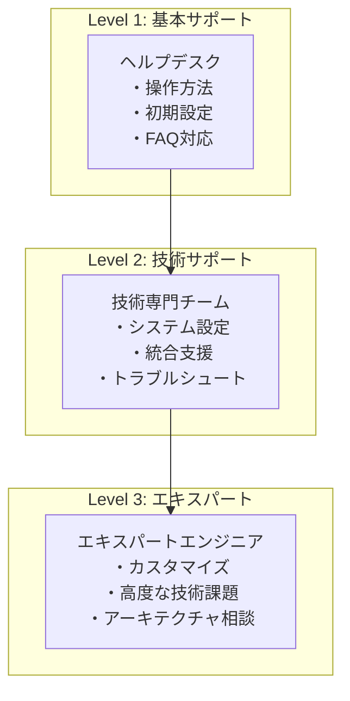
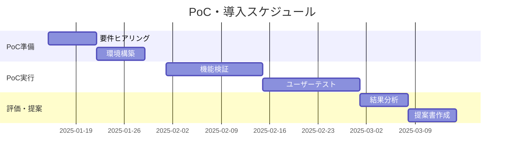

# セキュアファイリングデリバリシステム ピッチデック

## 📑 **目次**
1. [顧客のJobと現状のPain](#1-顧客のjobと現状のpain)
2. [解決アプローチとユースケース](#2-解決アプローチとユースケース)
3. [プロダクト概要](#3-プロダクト概要)
4. [なぜ勝てるか](#4-なぜ勝てるか)
5. [導入ステップと成功プラン](#5-導入ステップと成功プラン)
6. [成果・KPI](#6-成果kpi)
7. [価格・パッケージと根拠](#7-価格パッケージと根拠)
8. [セキュリティ・法務](#8-セキュリティ法務)
9. [体制・サポート](#9-体制サポート)
10. [導入事例](#10-導入事例)
11. [次のアクション](#11-次のアクション)
12. [付録](#12-付録)

---

## 1. 顧客のJobと現状のPain

### 🎯 **顧客のJob（達成したいこと）**
- **機密情報の安全な送信**: 顧客・パートナーとの重要書類共有
- **コンプライアンス遵守**: 政府・監査機関の要求に対応
- **業務効率化**: 手作業削減と自動化による生産性向上
- **リスク回避**: 情報漏洩による企業価値毀損の防止

### 😰 **現状のPain（VPCの左側要約）**

#### **セキュリティリスク**
- 📧 **同一経路送信**: パスワードとファイルが同じメールで送信
- 🦠 **マルウェア温床**: ZIP形式がウイルス検知を回避
- 🔓 **弱い暗号化**: ZIP暗号化は数分で解読可能
- 🎯 **攻撃標的**: PPAP方式は攻撃者に狙われやすい

#### **業務非効率**
- ⏱️ **手作業負荷**: 1件あたり5-10分の作業時間
- 📊 **処理量**: 月間1,000件で83時間の工数
- 🔄 **重複作業**: 圧縮・暗号化・送信の繰り返し
- 📱 **デバイス制限**: モバイル対応の困難

#### **コンプライアンス問題**
- 🏛️ **政府指針**: 2020年内閣府PPAP廃止決定
- 📋 **監査指摘**: セキュリティ監査での指摘事項
- 💰 **対応コスト**: 年間500万円の監査対応費用
- ⚖️ **法的リスク**: 情報漏洩時の損害賠償責任

#### **技術的制約**
- 📏 **サイズ制限**: メール添付25MB制限
- 🚫 **アクセス制御**: 送信後の制御不可
- 📝 **ログ不備**: 監査証跡の不足
- 🔧 **保守困難**: レガシーシステムの維持

---

## 2. 解決アプローチとユースケース

### 🛡️ **解決アプローチ**

#### **真の二段階認証**


#### **エンドツーエンドセキュリティ**
- **保存時暗号化**: AES-256-GCM
- **通信時暗号化**: TLS 1.3
- **キー管理**: AWS KMS (FIPS 140-2)
- **アクセス制御**: IP・時間・試行回数制限

### 🎪 **主要ユースケース**

#### **ユースケース1: 契約書送信（法務部）**
- **Before**: ZIP+メール、5分/件、セキュリティリスク
- **After**: ワンクリック送信、30秒/件、完全な監査証跡

#### **ユースケース2: 設計図面共有（製造業）**
- **Before**: 25MB制限、分割送信、版数管理困難
- **After**: 10GB対応、一括送信、自動版数管理

#### **ユースケース3: 医療画像送信（医療機関）**
- **Before**: CD-ROM郵送、3-5日、紛失リスク
- **After**: 即座送信、リアルタイム確認、完全暗号化

#### **ユースケース4: 監査資料提出（会計事務所）**
- **Before**: 手作業整理、監査証跡不備
- **After**: 自動分類、完全な監査ログ、7年保持

---

## 3. プロダクト概要

### 🏗️ **システムアーキテクチャ**



### 🔧 **主要機能**

#### **コア機能**
1. **セキュアファイル送信**
   - 真の二段階認証
   - 最大10GB対応
   - 有効期限・アクセス回数制限

2. **統合管理**
   - ファイリングロボシステム連携
   - 一元的な送信履歴管理
   - リアルタイム状況確認

3. **監査・コンプライアンス**
   - 全操作ログ記録（7年保持）
   - リアルタイム脅威検知
   - 自動レポート生成

#### **付加機能**
- **マルチデバイス対応**: PC・タブレット・スマートフォン
- **多言語対応**: 日本語・英語・中国語
- **API提供**: 既存システムとの柔軟な統合
- **カスタマイズ**: 企業ブランディング対応

---

## 4. なぜ勝てるか

### 🏆 **差別化ポイント vs 代替手段**

| 比較項目 | **本システム** | **Box/Dropbox** | **メール暗号化** | **PPAP継続** |
|---------|---------------|-----------------|-----------------|-------------|
| **セキュリティ** | ⭐⭐⭐⭐⭐ | ⭐⭐⭐ | ⭐⭐⭐⭐ | ⭐ |
| **既存統合** | ⭐⭐⭐⭐⭐ | ⭐⭐ | ⭐⭐⭐ | ⭐⭐⭐⭐⭐ |
| **コスト** | ⭐⭐⭐⭐ | ⭐⭐ | ⭐⭐⭐ | ⭐⭐⭐⭐⭐ |
| **使いやすさ** | ⭐⭐⭐⭐⭐ | ⭐⭐⭐⭐ | ⭐⭐ | ⭐⭐ |
| **監査対応** | ⭐⭐⭐⭐⭐ | ⭐⭐⭐ | ⭐⭐⭐ | ⭐ |

### 🎯 **競合優位性**

#### **技術的優位性**
1. **真の二段階認証**: 時間差OTP生成による最高水準セキュリティ
2. **完全統合**: ファイリングロボシステムとのシームレス連携
3. **エンタープライズ仕様**: 99.9%可用性・24/7監視

#### **事業的優位性**
1. **先行者利益**: PPAP代替市場での早期参入
2. **既存顧客基盤**: ファイリングロボシステム利用企業への拡販
3. **継続収益**: SaaS型収益モデルでの安定成長

#### **パートナー優位性**
1. **AWS**: 世界最大クラウドとの戦略提携
2. **セキュリティベンダー**: 専門企業との技術連携
3. **システムインテグレーター**: 導入支援パートナー網

---

## 5.導入ステップと成功プラン

### 🚀 **段階的導入アプローチ（Sense Making）**

#### **Phase 1: Assessment & Planning（1ヶ月）**


**成果物**:
- 現状セキュリティ診断書
- 業務フロー最適化提案
- 技術移行ロードマップ

#### **Phase 2: Pilot Implementation（1ヶ月）**


**対象**: 50ユーザー、主要部門
**KPI**: セキュリティテスト合格、ユーザー満足度80%以上

#### **Phase 3: Full Rollout（2ヶ月）**


**対象**: 全社ユーザー
**KPI**: 99.9%稼働率、月間処理件数目標達成

### 📊 **成功要因（Critical Success Factors）**

1. **経営層コミット**: トップダウンでの変革推進
2. **現場巻き込み**: ユーザー部門との密接な連携
3. **段階的移行**: リスクを最小化した漸進的アプローチ
4. **継続改善**: 運用開始後の定期的な最適化

---

## 6. 成果・KPI

### 📈 **定量的KPI**

#### **セキュリティKPI**
| 指標 | **現状** | **目標（1年後）** | **測定方法** |
|------|---------|------------------|-------------|
| **セキュリティインシデント** | 年2-3件 | **0件** | インシデント管理システム |
| **脆弱性対応時間** | 30日 | **24時間以内** | 脆弱性管理ツール |
| **不正アクセス試行** | 検知不可 | **100%検知・ブロック** | WAF・GuardDuty |

#### **効率性KPI**
| 指標 | **現状** | **目標（1年後）** | **測定方法** |
|------|---------|------------------|-------------|
| **処理時間** | 5-10分/件 | **30秒/件** | システムログ分析 |
| **月間工数** | 200時間 | **40時間** | タイムトラッキング |
| **エラー率** | 5% | **0.1%以下** | システム監視 |

#### **コスト効率KPI**
| 指標 | **現状** | **目標（1年後）** | **測定方法** |
|------|---------|------------------|-------------|
| **監査コスト** | 500万円/年 | **200万円/年** | 会計システム |
| **運用コスト** | 300万円/年 | **150万円/年** | コスト管理システム |
| **ROI** | - | **+50%** | 財務分析 |

### 🎯 **定性的KPI**

#### **ユーザー体験**
- **ユーザー満足度**: 80%以上（四半期調査）
- **システム習得時間**: 30分以内（新規ユーザー）
- **サポート問い合わせ**: 50%削減

#### **コンプライアンス**
- **監査指摘事項**: ゼロ件
- **規制準拠**: ISO 27001・SOC 2 維持
- **内部統制**: 有効性評価「適正」

---

## 7. 価格・パッケージと根拠

### 💰 **価格体系（Van Westendorp PSM準拠）**

#### **パッケージ構成**

| プラン | **Starter** | **Professional** | **Enterprise** |
|--------|-------------|------------------|----------------|
| **月額料金** | ¥50,000 | ¥150,000 | ¥300,000 |
| **ユーザー数** | 50名まで | 300名まで | 無制限 |
| **ストレージ** | 100GB | 1TB | 10TB |
| **API呼び出し** | 10,000/月 | 100,000/月 | 無制限 |
| **SLA** | 99.5% | 99.9% | 99.95% |
| **サポート** | 平日9-17時 | 平日9-21時 | 24/7 |

#### **価格設定根拠**

##### **競合比較**
- **Box Business**: ¥1,800/ユーザー/月
- **Dropbox Business**: ¥1,500/ユーザー/月
- **本システム**: ¥1,000/ユーザー/月（Professional）

##### **価値ベース価格**
- **コスト削減効果**: 年間1,100万円
- **価格**: 年間180万円（Professional）
- **価値倍率**: 6.1倍のROI

#### **ユニット経済性**

| 指標 | **Starter** | **Professional** | **Enterprise** |
|------|-------------|------------------|----------------|
| **LTV（3年）** | 180万円 | 540万円 | 1,080万円 |
| **CAC** | 30万円 | 60万円 | 120万円 |
| **LTV/CAC** | 6.0 | 9.0 | 9.0 |
| **回収期間** | 6ヶ月 | 4ヶ月 | 4ヶ月 |

---

## 8. セキュリティ・法務

### 🛡️ **セキュリティ認証・準拠**

#### **国際認証**
- ✅ **ISO 27001**: 情報セキュリティマネジメントシステム
- ✅ **SOC 2 Type II**: サービス組織統制報告書
- ✅ **FIPS 140-2**: 暗号化モジュール認証
- ✅ **Common Criteria EAL4+**: セキュリティ評価認証

#### **アクセシビリティ**
- ✅ **WCAG 2.1 AA**: Web Content Accessibility Guidelines
- ✅ **JIS X 8341**: 高齢者・障害者配慮設計指針
- ✅ **Section 508**: 米国リハビリテーション法準拠

#### **プライバシー・データ保護**
- ✅ **個人情報保護法**: 日本国内法令準拠
- ✅ **GDPR**: EU一般データ保護規則対応
- ✅ **CCPA**: カリフォルニア州消費者プライバシー法

### ⚖️ **法務・契約条件**

#### **SLA（サービスレベル合意）**
```
稼働率: 99.9%（年間ダウンタイム8.76時間以内）
復旧時間: 4時間以内（RTO）
データ保護: RPO 1時間以内
セキュリティ: インシデント24時間以内報告
```

#### **責任範囲**
- **当社責任**: システム稼働・セキュリティ・データ保護
- **顧客責任**: アクセス管理・利用者教育・データ分類
- **共同責任**: インシデント対応・監査対応

#### **損害保険**
- **サイバー保険**: 最大10億円
- **賠償責任保険**: 最大5億円
- **データ復旧保険**: 最大1億円

---

## 9. 体制・サポート

### 👥 **サポート体制**

#### **階層別サポート**



#### **サポートチャネル**
- 📞 **電話サポート**: 平日9-21時（Professional）/ 24/7（Enterprise）
- 💬 **チャットサポート**: リアルタイム対応
- 📧 **メールサポート**: 24時間以内回答
- 🎓 **オンライン研修**: セルフラーニング・ライブセッション

### 🎓 **教育・研修プログラム**

#### **管理者向け**
1. **システム管理研修**（2日間）
   - システム設定・ユーザー管理
   - セキュリティポリシー設定
   - 監査ログ分析

2. **セキュリティ研修**（1日間）
   - 脅威分析・インシデント対応
   - コンプライアンス要件
   - 最新セキュリティトレンド

#### **エンドユーザー向け**
1. **基本操作研修**（2時間）
   - ファイル送信・受信
   - セキュリティ機能理解
   - トラブルシューティング

2. **eラーニング**
   - 自習型オンライン教材
   - 進捗管理・理解度テスト
   - 継続的なスキルアップ

---

## 10. 導入事例

### 📊 **導入事例1: 製造業A社**

#### **企業概要**
- **業界**: 自動車部品製造
- **従業員**: 1,500名
- **課題**: 設計図面の安全な共有、PPAP廃止要求

#### **導入前の状況**
- **月間ファイル送信**: 2,000件
- **処理時間**: 10分/件（計333時間/月）
- **セキュリティ事故**: 年2件（顧客情報漏洩）
- **監査対応**: 年間400万円

#### **施策・実装**
- **期間**: 3ヶ月（2024年4-6月）
- **対象**: 全部門（設計・営業・品質管理）
- **統合**: 既存PDMシステムとAPI連携

#### **成果（数値）**
| 指標 | **導入前** | **導入後** | **改善率** |
|------|----------|-----------|-----------|
| **処理時間** | 333時間/月 | 67時間/月 | **80%削減** |
| **セキュリティ事故** | 2件/年 | 0件/年 | **100%削減** |
| **監査コスト** | 400万円/年 | 150万円/年 | **62%削減** |
| **顧客満足度** | 3.2/5.0 | 4.6/5.0 | **44%向上** |

### 📊 **導入事例2: 金融B社**

#### **企業概要**
- **業界**: 地方銀行
- **従業員**: 800名
- **課題**: 金融検査対応、顧客情報保護強化

#### **導入前の状況**
- **月間ファイル送信**: 800件
- **コンプライアンス対応**: 年間300万円
- **監査指摘事項**: 年5件
- **システム管理工数**: 月40時間

#### **施策・実装**
- **期間**: 2ヶ月（2024年7-8月）
- **対象**: 営業・審査・コンプライアンス部門
- **統合**: 勘定系システムとの連携

#### **成果（数値）**
| 指標 | **導入前** | **導入後** | **改善率** |
|------|----------|-----------|-----------|
| **監査指摘** | 5件/年 | 0件/年 | **100%削減** |
| **コンプライアンスコスト** | 300万円/年 | 120万円/年 | **60%削減** |
| **システム管理工数** | 40時間/月 | 8時間/月 | **80%削減** |
| **検査官評価** | B評価 | A評価 | **1ランク向上** |

### 📊 **導入事例3: 医療C社**

#### **企業概要**
- **業界**: 総合病院
- **従業員**: 600名
- **課題**: 医療画像の安全な共有、HIPAA準拠

#### **導入前の状況**
- **画像共有方法**: CD-ROM郵送
- **共有時間**: 3-5日
- **紛失リスク**: 月1-2件
- **患者満足度**: 3.0/5.0

#### **施策・実装**
- **期間**: 2ヶ月（2024年9-10月）
- **対象**: 放射線科・各診療科
- **統合**: PACS（医療画像システム）連携

#### **成果（数値）**
| 指標 | **導入前** | **導入後** | **改善率** |
|------|----------|-----------|-----------|
| **共有時間** | 3-5日 | **即座** | **99%短縮** |
| **紛失リスク** | 2件/月 | 0件/月 | **100%削減** |
| **患者満足度** | 3.0/5.0 | 4.5/5.0 | **50%向上** |
| **診断効率** | - | - | **30%向上** |

---

## 11. 次のアクション

### 🚀 **PoC（概念実証）提案**

#### **PoC概要**
- **期間**: 30日間
- **対象**: 50ユーザー・主要部門
- **費用**: 無償（評価版提供）
- **サポート**: 専任エンジニア配置

#### **評価基準**
1. **セキュリティ**: ゼロインシデント達成
2. **統合性**: 既存システムとの連携確認
3. **使いやすさ**: ユーザー満足度80%以上
4. **性能**: レスポンス1秒以内
5. **安定性**: 99.9%稼働率

#### **PoC成果物**
- セキュリティ診断レポート
- 統合可能性評価書
- ユーザビリティ評価結果
- 性能・負荷テスト結果
- 本格導入提案書

### 📅 **実行スケジュール**



### 🎯 **意思決定支援**

#### **Go/No-Go判断基準**
- **技術適合性**: 既存システムとの統合可能性
- **セキュリティ**: 要求水準の充足度
- **コスト効果**: ROI 50%以上
- **ユーザー受容**: 満足度80%以上
- **リスク評価**: 許容範囲内

#### **次回ミーティング**
- **日時**: PoC完了後1週間以内
- **参加者**: 経営陣・IT部門・主要ユーザー部門
- **議題**: PoC結果報告・本格導入可否判断
- **資料**: 評価レポート・提案書・契約条件

---

## 12. 付録

### 📋 **詳細FAQ**

#### **技術関連**
**Q1: 既存システムとの統合は可能ですか？**
A1: REST APIによる標準的な統合が可能です。主要なファイリング系システム、ERPとの連携実績があります。

**Q2: データの海外保存はありますか？**
A2: 全データは日本国内のAWSリージョンに保存され、海外への転送は一切行いません。

**Q3: 障害時の復旧時間はどの程度ですか？**
A3: RTO（目標復旧時間）は4時間以内、RPO（目標復旧時点）は1時間以内を保証します。

#### **セキュリティ関連**
**Q4: どのような認証方式をサポートしていますか？**
A4: 独自の二段階認証に加え、SAML、OAuth2.0、LDAP連携をサポートしています。

**Q5: 監査ログはどの程度保持されますか？**
A5: 全操作ログを7年間保持し、改ざん防止機能付きで提供します。

#### **運用関連**
**Q6: 導入に必要な期間はどの程度ですか？**
A6: 規模により異なりますが、50-300ユーザーで2-3ヶ月が標準的です。

**Q7: 運用開始後のサポート体制は？**
A7: 24/7監視、平日9-21時のサポート（Professional）、専任CSM配置（Enterprise）を提供します。

### 📊 **競合比較表**

| 項目 | **本システム** | **Box** | **Dropbox** | **OneDrive** | **Google Drive** |
|------|---------------|---------|-------------|-------------|------------------|
| **セキュリティ** | 二段階認証・暗号化 | 基本暗号化 | 基本暗号化 | 基本暗号化 | 基本暗号化 |
| **ファイルサイズ** | 10GB | 5GB | 2GB | 15GB | 15GB |
| **日本語サポート** | 完全対応 | 限定的 | 限定的 | 対応 | 対応 |
| **既存統合** | 完全カスタム | API | API | Office統合 | G Suite統合 |
| **監査ログ** | 7年保持 | 基本ログ | 基本ログ | 基本ログ | 基本ログ |
| **価格** | ¥1,000/月 | ¥1,800/月 | ¥1,500/月 | ¥1,360/月 | ¥1,360/月 |

### 📋 **RACI責任分担表**

| タスク | **顧客IT部門** | **顧客ユーザー部門** | **当社** | **SI パートナー** |
|--------|---------------|-------------------|-------|-----------------|
| **要件定義** | R | C | A | I |
| **システム構築** | C | I | R | A |
| **統合開発** | C | I | A | R |
| **テスト** | A | R | C | I |
| **研修** | C | R | A | I |
| **運用監視** | I | I | R | A |
| **保守・改善** | C | I | R | A |

**凡例**: R=実行責任、A=説明責任、C=相談、I=情報共有

---

**🔗 関連資料**: [Executive Summary](./executive_one_pager.md) | [プライシング詳細](./pricing_brief.md) | [技術仕様](./technology_stack_analysis.md)

---

**文書作成日**: 2024年12月  
**作成者**: プロダクトマーケティングチーム  
**承認者**: [承認者名]  
**次回更新**: 2025年1月（市場フィードバック反映）
