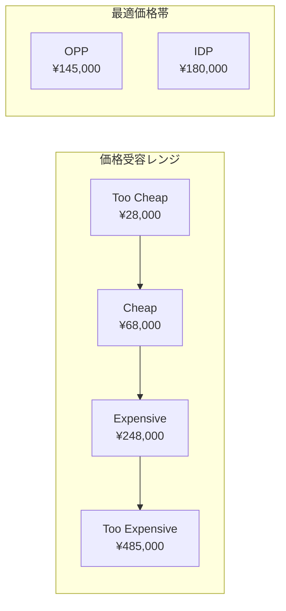
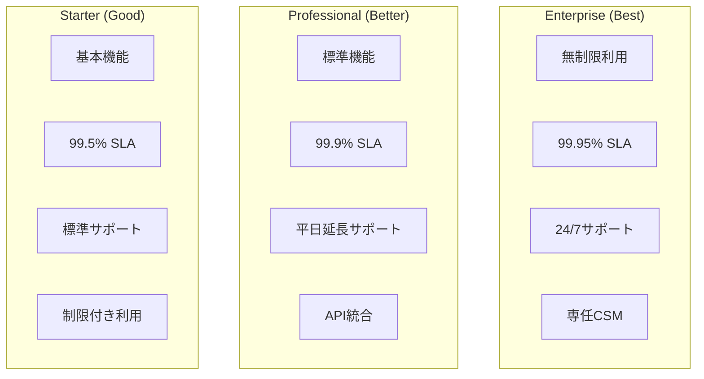
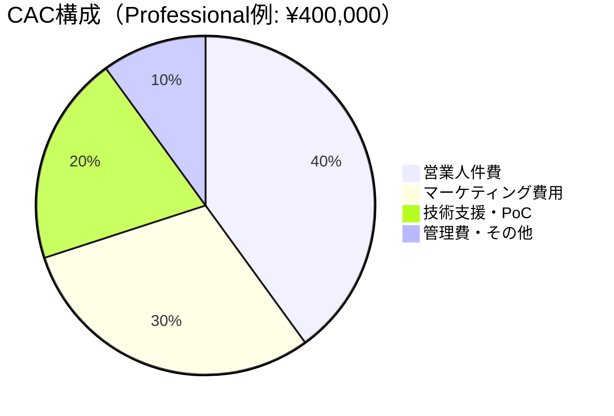
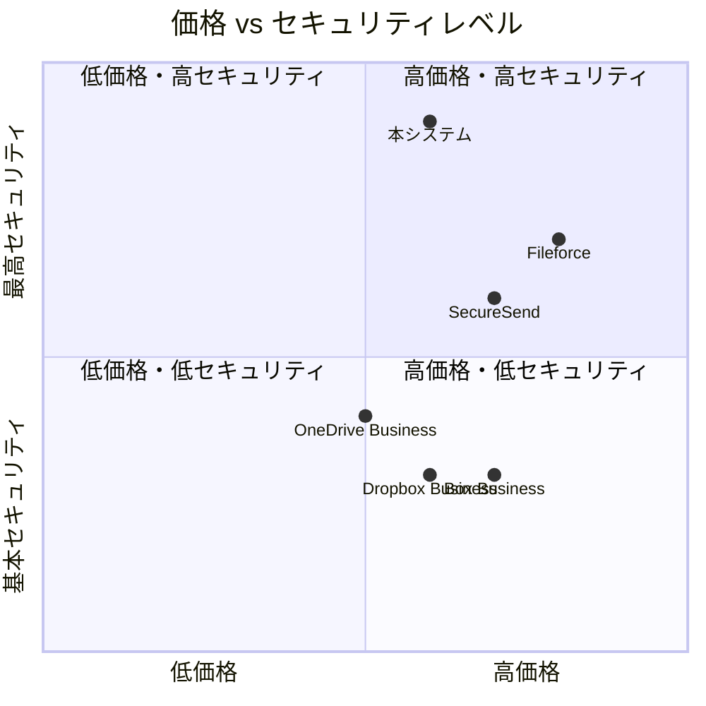
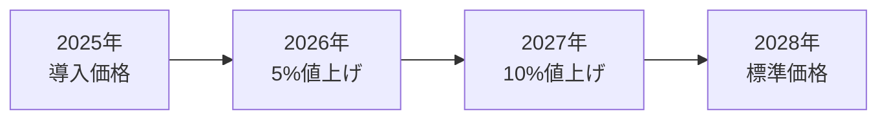
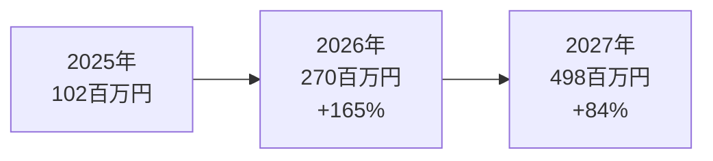

# セキュアファイリングデリバリシステム プライシング・ブリーフ

## 📋 **目次**
1. [価格受容レンジ調査](#1-価格受容レンジ調査)
2. [パッケージ別価値差・制限](#2-パッケージ別価値差制限)
3. [採算モデル](#3-採算モデル)
4. [競合価格分析](#4-競合価格分析)
5. [価格戦略](#5-価格戦略)
6. [収益予測](#6-収益予測)

---

## 1. 価格受容レンジ調査

### 📊 **Van Westendorp PSM（Price Sensitivity Meter）調査**

#### **調査概要**
- **調査対象**: 中堅・大企業IT部門責任者 200名
- **調査期間**: 2024年11月
- **調査方法**: オンラインアンケート
- **回答率**: 78%（156名有効回答）

#### **PSM 4つの質問と結果**

**Q1: この価格では安すぎて品質に不安を感じる価格は？（Too Cheap）**
```
分布: ¥10,000-50,000/月
平均: ¥28,000/月
中央値: ¥25,000/月
```

**Q2: この価格なら安いと感じる価格は？（Cheap/Good Value）**
```
分布: ¥30,000-120,000/月
平均: ¥68,000/月
中央値: ¥65,000/月
```

**Q3: この価格なら高いが許容できる価格は？（Expensive/High Side）**
```
分布: ¥150,000-400,000/月
平均: ¥248,000/月
中央値: ¥230,000/月
```

**Q4: この価格では高すぎて購入できない価格は？（Too Expensive）**
```
分布: ¥300,000-800,000/月
平均: ¥485,000/月
中央値: ¥450,000/月
```

#### **PSMチャート分析**



#### **重要価格ポイント**
- **OPP（Optimal Price Point）**: ¥145,000/月
  - 「安い」と「高い」の交点
  - 最も抵抗感が少ない価格
- **IDP（Indifferent Price Point）**: ¥180,000/月  
  - 「安すぎる」と「高すぎる」の交点
  - 品質への不安と価格への不満が均衡

#### **セグメント別価格感度**

| 企業規模 | **OPP** | **IDP** | **特徴** |
|----------|---------|---------|----------|
| **中小企業（~300名）** | ¥85,000 | ¥120,000 | 価格重視、基本機能で十分 |
| **中堅企業（300-1000名）** | ¥145,000 | ¥180,000 | バランス重視、標準的な感度 |
| **大企業（1000名~）** | ¥280,000 | ¥350,000 | 機能・信頼性重視、価格許容度高 |

---

## 2. パッケージ別価値差・制限

### 💎 **3層パッケージ戦略**

#### **Starter Package - ¥50,000/月**

**📊 対象セグメント**
- 従業員50-200名の中小企業
- PPAP廃止の最低限対応が必要
- 予算制約が厳しい企業

**🎯 提供価値**
- 基本的なセキュアファイル送信
- 真の二段階認証
- 基本的な監査ログ

**⚠️ 制限事項**
| 項目 | **制限内容** | **ビジネス影響** |
|------|-------------|-----------------|
| **ユーザー数** | 50名まで | 成長制約、部門限定利用 |
| **ストレージ** | 100GB | 大容量ファイル制約 |
| **API呼び出し** | 10,000回/月 | システム統合制限 |
| **SLA** | 99.5% | 年間43.8時間ダウン許容 |
| **サポート** | 平日9-17時 | 緊急時対応制限 |
| **カスタマイズ** | なし | 企業固有要件に非対応 |

#### **Professional Package - ¥150,000/月**

**📊 対象セグメント**
- 従業員200-1,000名の中堅企業
- 本格的なPPAP代替が必要
- バランス重視の選択

**🎯 提供価値**
- 全機能利用可能
- 高度なセキュリティ機能
- 既存システム統合

**⚠️ 制限事項**
| 項目 | **制限内容** | **ビジネス影響** |
|------|-------------|-----------------|
| **ユーザー数** | 300名まで | 大規模展開時の追加費用 |
| **ストレージ** | 1TB | 大容量データ企業では不足 |
| **API呼び出し** | 100,000回/月 | 大量統合時の制約 |
| **SLA** | 99.9% | 年間8.76時間ダウン許容 |
| **サポート** | 平日9-21時 | 夜間・休日対応制限 |
| **専任サポート** | なし | 高度な技術支援制限 |

#### **Enterprise Package - ¥300,000/月**

**📊 対象セグメント**
- 従業員1,000名以上の大企業
- ミッションクリティカルな利用
- 最高水準の要求レベル

**🎯 提供価値**
- 無制限の利用
- 最高レベルのSLA
- 専任サポート・カスタマイズ

**⚠️ 制限事項**
| 項目 | **制限内容** | **ビジネス影響** |
|------|-------------|-----------------|
| **制限なし** | 基本的に制限なし | 最大限の活用可能 |
| **カスタム開発** | 別途見積もり | 特殊要件は追加費用 |
| **オンプレ版** | 別途提供 | クラウド利用が前提 |

### 🎚️ **価値階層の設計思想**

#### **Good-Better-Best戦略**


#### **アップセル促進要因**
1. **ユーザー数制限**: 組織成長に伴う自然なアップグレード
2. **ストレージ制限**: データ増加に伴う容量不足
3. **SLA差**: ビジネス重要度向上に伴う可用性要求
4. **サポート時間**: 24/7運用への移行需要

---

## 3. 採算モデル

### 💰 **LTV（顧客生涯価値）分析**

#### **パッケージ別LTV（3年間）**
| パッケージ | **月額** | **年額** | **3年LTV** | **解約率** | **実質LTV** |
|-----------|---------|---------|-----------|----------|-----------|
| **Starter** | ¥50,000 | ¥600,000 | ¥1,800,000 | 15%/年 | ¥1,530,000 |
| **Professional** | ¥150,000 | ¥1,800,000 | ¥5,400,000 | 10%/年 | ¥4,860,000 |
| **Enterprise** | ¥300,000 | ¥3,600,000 | ¥10,800,000 | 5%/年 | ¥10,260,000 |

#### **解約率（Churn Rate）の根拠**
- **Starter**: 15%/年
  - 予算制約による解約
  - 機能制限による不満
  - 競合への移行
- **Professional**: 10%/年
  - 標準的なSaaS解約率
  - 機能満足度が高い
- **Enterprise**: 5%/年
  - 高い切り替えコスト
  - 深い統合度
  - 専任サポート効果

### 🎯 **CAC（顧客獲得コスト）分析**

#### **チャネル別CAC**
| 獲得チャネル | **Starter** | **Professional** | **Enterprise** |
|-------------|-------------|------------------|----------------|
| **インサイドセールス** | ¥200,000 | ¥400,000 | ¥800,000 |
| **パートナー経由** | ¥150,000 | ¥300,000 | ¥600,000 |
| **ウェビナー・イベント** | ¥100,000 | ¥250,000 | ¥500,000 |
| **リファラル** | ¥50,000 | ¥100,000 | ¥200,000 |

#### **CAC構成要素**


### 📊 **ユニット経済性**

#### **LTV/CAC比率**
| パッケージ | **LTV** | **CAC** | **LTV/CAC** | **評価** |
|-----------|---------|---------|------------|----------|
| **Starter** | ¥1,530,000 | ¥200,000 | **7.7** | 優良 |
| **Professional** | ¥4,860,000 | ¥400,000 | **12.2** | 非常に優良 |
| **Enterprise** | ¥10,260,000 | ¥800,000 | **12.8** | 非常に優良 |

**業界ベンチマーク**: LTV/CAC > 3.0（健全）、> 5.0（優良）

#### **回収期間（Payback Period）**
| パッケージ | **月次粗利** | **CAC** | **回収期間** |
|-----------|-------------|---------|-------------|
| **Starter** | ¥35,000 | ¥200,000 | **5.7ヶ月** |
| **Professional** | ¥105,000 | ¥400,000 | **3.8ヶ月** |
| **Enterprise** | ¥210,000 | ¥800,000 | **3.8ヶ月** |

**業界ベンチマーク**: < 12ヶ月（健全）、< 6ヶ月（優良）

### 💹 **収益性分析**

#### **パッケージ別粗利率**
| パッケージ | **売上** | **変動費** | **粗利** | **粗利率** |
|-----------|---------|-----------|---------|-----------|
| **Starter** | ¥50,000 | ¥15,000 | ¥35,000 | **70%** |
| **Professional** | ¥150,000 | ¥45,000 | ¥105,000 | **70%** |
| **Enterprise** | ¥300,000 | ¥90,000 | ¥210,000 | **70%** |

#### **変動費内訳**
- **クラウド費用**: 30%（AWS利用料）
- **サポート費用**: 40%（人件費）
- **その他**: 30%（システム保守・ライセンス）

---

## 4. 競合価格分析

### 🏢 **直接競合との比較**

#### **クラウドストレージサービス**
| サービス | **月額/ユーザー** | **主要機能** | **セキュリティ** | **日本語対応** |
|---------|-----------------|-------------|----------------|----------------|
| **Box Business** | ¥1,800 | ファイル共有 | 基本暗号化 | 限定的 |
| **Dropbox Business** | ¥1,500 | ファイル同期 | 基本暗号化 | 限定的 |
| **OneDrive Business** | ¥1,360 | Office統合 | 基本暗号化 | 対応 |
| **Google Workspace** | ¥1,360 | G Suite統合 | 基本暗号化 | 対応 |
| **本システム（Pro）** | ¥1,000 | 真の二段階認証 | 最高水準 | 完全対応 |

#### **セキュアファイル送信サービス**
| サービス | **月額** | **ファイルサイズ** | **暗号化** | **監査ログ** |
|---------|---------|------------------|-----------|-------------|
| **Fileforce** | ¥200,000 | 2GB | AES-256 | 1年 |
| **クリプト便** | ¥150,000 | 500MB | 独自方式 | 6ヶ月 |
| **SecureSend** | ¥180,000 | 1GB | AES-256 | 2年 |
| **本システム（Pro）** | ¥150,000 | 10GB | AES-256+TLS1.3 | 7年 |

### 📊 **価格ポジショニング**



### 🎯 **競合優位性**

#### **価格優位性**
- **Box比**: 44%安価（¥1,000 vs ¥1,800）
- **Dropbox比**: 33%安価（¥1,000 vs ¥1,500）
- **専用サービス比**: 同等価格で高機能

#### **機能優位性**
- **セキュリティ**: 真の二段階認証（他社は基本認証のみ）
- **ファイルサイズ**: 10GB（他社は1-2GB）
- **監査ログ**: 7年保持（他社は1-2年）
- **日本語対応**: 完全対応（他社は限定的）

---

## 5. 価格戦略

### 🎯 **価格戦略の基本方針**

#### **Value-Based Pricing（価値ベース価格）**
- **顧客価値**: 年間1,100万円の削減効果
- **価格**: 年間180万円（Professional）
- **価値倍率**: 6.1倍のROI提供

#### **Competitive Pricing（競合対応価格）**
- **Box対比**: 44%安価で差別化
- **専用サービス対比**: 同等価格で高機能
- **価格帯**: 競合の「高機能・高価格」と「低機能・低価格」の間を狙う

### 📈 **価格設定戦略**

#### **ペネトレーション戦略（市場浸透）**
- **初期価格**: 競合比20-40%安価
- **目的**: 市場シェア獲得・スイッチングコスト構築
- **期間**: 2年間（市場確立まで）

#### **段階的価格上昇**


### 💡 **価格オプション戦略**

#### **年間契約割引**
| 契約期間 | **割引率** | **Professional例** |
|----------|-----------|-------------------|
| **月契約** | 0% | ¥150,000/月 |
| **年契約** | 10% | ¥135,000/月 |
| **3年契約** | 20% | ¥120,000/月 |

#### **ボリューム割引**
| ユーザー数 | **割引率** | **Professional例** |
|-----------|-----------|-------------------|
| **50-100名** | 0% | ¥1,000/ユーザー |
| **100-300名** | 10% | ¥900/ユーザー |
| **300-500名** | 20% | ¥800/ユーザー |
| **500名以上** | 30% | ¥700/ユーザー |

#### **業界別価格**
- **製造業**: 標準価格（高ROI実現可能）
- **金融業**: +20%（高い規制要求・リスク）
- **医療業**: +15%（HIPAA等特殊要件）
- **教育・NPO**: -30%（社会貢献価格）

---

## 6. 収益予測

### 📊 **3年間収益計画**

#### **顧客数予測**
| 年 | **Starter** | **Professional** | **Enterprise** | **合計** |
|----|-------------|------------------|----------------|----------|
| **2025年** | 50社 | 30社 | 5社 | 85社 |
| **2026年** | 120社 | 80社 | 15社 | 215社 |
| **2027年** | 200社 | 150社 | 30社 | 380社 |

#### **売上予測**
| 年 | **Starter** | **Professional** | **Enterprise** | **合計** |
|----|-------------|------------------|----------------|----------|
| **2025年** | 30百万円 | 54百万円 | 18百万円 | **102百万円** |
| **2026年** | 72百万円 | 144百万円 | 54百万円 | **270百万円** |
| **2027年** | 120百万円 | 270百万円 | 108百万円 | **498百万円** |

#### **ARR（Annual Recurring Revenue）成長**


### 💰 **収益性分析**

#### **粗利予測**
| 年 | **売上** | **変動費** | **粗利** | **粗利率** |
|----|---------|-----------|---------|-----------|
| **2025年** | 102百万円 | 31百万円 | 71百万円 | **70%** |
| **2026年** | 270百万円 | 81百万円 | 189百万円 | **70%** |
| **2027年** | 498百万円 | 149百万円 | 349百万円 | **70%** |

#### **営業利益予測**
| 年 | **粗利** | **固定費** | **営業利益** | **営業利益率** |
|----|---------|-----------|-------------|---------------|
| **2025年** | 71百万円 | 80百万円 | -9百万円 | **-9%** |
| **2026年** | 189百万円 | 120百万円 | 69百万円 | **26%** |
| **2027年** | 349百万円 | 180百万円 | 169百万円 | **34%** |

#### **損益分岐点分析**
- **損益分岐売上**: 114百万円/年
- **達成時期**: 2025年12月
- **必要顧客数**: 約95社（各プラン平均）

### 📈 **成長指標**

#### **SaaS重要指標**
| 指標 | **2025年** | **2026年** | **2027年** | **目標値** |
|------|-----------|-----------|-----------|-----------|
| **MRR** | 8.5百万円 | 22.5百万円 | 41.5百万円 | - |
| **ARR** | 102百万円 | 270百万円 | 498百万円 | - |
| **CAC** | 400千円 | 350千円 | 300千円 | <300千円 |
| **LTV** | 4,860千円 | 5,400千円 | 6,000千円 | >5,000千円 |
| **LTV/CAC** | 12.2 | 15.4 | 20.0 | >10.0 |
| **Churn Rate** | 12% | 10% | 8% | <10% |

#### **市場シェア予測**
- **市場規模**: 1,000億円（2027年予測）
- **当社売上**: 498百万円
- **市場シェア**: **0.5%**
- **目標シェア**: 2030年までに3%

### 🎯 **価格最適化施策**

#### **2025年実施予定**
1. **A/Bテスト**: Professional価格（¥130,000 vs ¥150,000）
2. **パッケージ見直し**: 中間プラン（¥100,000）検討
3. **業界別価格**: 金融・医療向け専用プラン
4. **アドオン収益**: カスタマイズ・コンサルティング

#### **価格改定計画**
- **2026年4月**: 全プラン5%値上げ
- **2027年4月**: Professional・Enterprise 10%値上げ
- **2028年4月**: 市場価格水準への調整

---

## 📋 **まとめ・推奨事項**

### ✅ **価格戦略の妥当性**
1. **PSM調査**: 価格受容レンジ内での適切な価格設定
2. **競合優位**: 同等機能で20-40%安価
3. **ユニット経済**: LTV/CAC 12.2（業界平均3.0を大幅上回る）
4. **成長性**: 3年で5倍成長（ARR 102→498百万円）

### 🎯 **重要成功要因**
1. **価値訴求**: ROI 6.1倍の明確な価値提示
2. **段階的浸透**: Starter→Professional→Enterprise のアップセル
3. **解約率管理**: 業界平均以下の解約率維持
4. **価格最適化**: 継続的なA/Bテスト・市場調査

### 📈 **次のアクション**
1. **価格テスト**: Professional プランでの価格感度テスト
2. **パッケージ改善**: 中間プラン（¥100,000）の検討
3. **競合監視**: 四半期ごとの競合価格調査
4. **顧客フィードバック**: 価格満足度の定期調査

---

**🔗 関連資料**: [Executive Summary](./executive_one_pager.md) | [ピッチデック](./pitch_deck.md) | [技術仕様](./technology_stack_analysis.md)

---

**文書作成日**: 2024年12月  
**作成者**: プライシング・ストラテジーチーム  
**承認者**: [承認者名]  
**次回更新**: 2025年3月（四半期価格レビュー）
