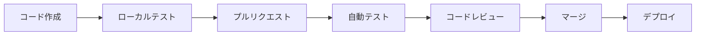

# 技術コンテキスト

## 使用技術

### フロントエンド技術スタック（候補）
- **フレームワーク**: React 18+ または Vue.js 3+
- **状態管理**: Redux Toolkit / Zustand または Pinia
- **UI ライブラリ**: Material-UI / Ant Design または Vuetify
- **ビルドツール**: Vite / Webpack 5
- **言語**: TypeScript
- **テスト**: Jest + React Testing Library / Vitest

### バックエンド技術スタック（候補）
- **言語・フレームワーク**:
  - Node.js + Express/Fastify
  - Python + FastAPI/Django
  - Go + Gin/Echo
- **API**: REST + GraphQL
- **認証**: OAuth 2.0 + OpenID Connect
- **データベース**: PostgreSQL（メイン）+ Redis（キャッシュ）
- **メッセージング**: RabbitMQ / Apache Kafka

### AI/ML技術スタック
- **機械学習**: TensorFlow / PyTorch
- **自然言語処理**: Transformers / spaCy
- **コード解析**: Tree-sitter / ANTLR
- **MLOps**: MLflow / Kubeflow
- **推論エンジン**: ONNX Runtime / TensorRT

### インフラ・DevOps
- **コンテナ**: Docker + Kubernetes
- **クラウド**: AWS / Azure / GCP（マルチクラウド対応）
- **CI/CD**: GitHub Actions / GitLab CI
- **監視**: Prometheus + Grafana
- **ログ**: ELK Stack (Elasticsearch, Logstash, Kibana)
- **セキュリティ**: Vault (秘密管理) / Falco (ランタイム監視)

## 開発環境

### 開発ツール
- **IDE**: Visual Studio Code / IntelliJ IDEA
- **バージョン管理**: Git + GitHub/GitLab
- **プロジェクト管理**: Jira / Linear
- **コミュニケーション**: Slack / Microsoft Teams
- **ドキュメント**: Notion / Confluence

### 開発環境構築
```bash
# 必要な開発環境
- Node.js 18+
- Python 3.9+
- Docker & Docker Compose
- Kubernetes CLI (kubectl)
- Cloud CLI (aws/az/gcloud)
```

### ローカル開発環境
```yaml
# docker-compose.yml (例)
version: '3.8'
services:
  frontend:
    build: ./frontend
    ports:
      - "3000:3000"
  backend:
    build: ./backend
    ports:
      - "8000:8000"
    environment:
      - DATABASE_URL=postgresql://user:pass@db:5432/app
  db:
    image: postgres:15
    environment:
      - POSTGRES_DB=app
      - POSTGRES_USER=user
      - POSTGRES_PASSWORD=pass
  redis:
    image: redis:7-alpine
    ports:
      - "6379:6379"
```

## 技術的制約

### セキュリティ制約
1. **暗号化要件**
   - データ保存時: AES-256
   - データ転送時: TLS 1.3
   - エンドツーエンド暗号化必須

2. **認証・認可**
   - 多要素認証（MFA）必須
   - ロールベースアクセス制御（RBAC）
   - セッション管理の強化

3. **コンプライアンス**
   - GDPR対応（EU市場展開時）
   - SOC 2 Type II準拠
   - ISO/IEC 27001準拠

### パフォーマンス制約
1. **レスポンス時間**
   - API応答: 2秒以内
   - ファイルアップロード: 100MB/分以上
   - AI解析: 大規模ファイルで10分以内

2. **スループット**
   - 同時接続: 1000ユーザー
   - ファイル処理: 100件/分
   - AI解析: 50件/時

3. **可用性**
   - システム稼働率: 99.9%
   - 復旧時間目標（RTO）: 4時間
   - 復旧ポイント目標（RPO）: 1時間

### スケーラビリティ制約
1. **水平スケーリング**
   - ステートレス設計
   - ロードバランサー対応
   - データベースシャーディング

2. **垂直スケーリング**
   - リソース使用量の最適化
   - メモリ効率的な実装
   - CPU集約的処理の分散

## 依存関係

### 外部サービス依存
1. **クラウドサービス**
   - ストレージ: AWS S3 / Azure Blob / GCS
   - CDN: CloudFront / Azure CDN / Cloud CDN
   - 認証: AWS Cognito / Azure AD / Firebase Auth

2. **サードパーティAPI**
   - メール送信: SendGrid / Amazon SES
   - 監視: Datadog / New Relic
   - セキュリティ: Snyk / Veracode

### 内部依存関係
1. **データベース依存**
   - PostgreSQL: メインデータ
   - Redis: セッション・キャッシュ
   - Elasticsearch: ログ・検索

2. **メッセージキュー依存**
   - RabbitMQ: 非同期処理
   - Kafka: イベントストリーミング

## ツールの使用パターン

### 開発フロー


### CI/CDパイプライン
1. **継続的インテグレーション**
   - 単体テスト実行
   - 静的コード解析
   - セキュリティスキャン
   - ビルド・パッケージング

2. **継続的デプロイ**
   - ステージング環境デプロイ
   - 統合テスト実行
   - 本番環境デプロイ
   - 監視・アラート設定

### 監視・ログ戦略
1. **アプリケーション監視**
   - APM (Application Performance Monitoring)
   - エラートラッキング
   - ユーザー行動分析

2. **インフラ監視**
   - リソース使用量監視
   - ネットワーク監視
   - セキュリティ監視

### セキュリティツール使用
1. **開発時セキュリティ**
   - SAST (Static Application Security Testing)
   - 依存関係脆弱性スキャン
   - シークレット検出

2. **運用時セキュリティ**
   - DAST (Dynamic Application Security Testing)
   - ランタイム保護
   - インシデント対応

## 技術選定の判断基準

### 評価軸
1. **セキュリティ**: 暗号化・認証機能の充実度
2. **パフォーマンス**: レスポンス時間・スループット
3. **スケーラビリティ**: 拡張性・可用性
4. **保守性**: コードの可読性・テスト容易性
5. **コミュニティ**: サポート・ドキュメント充実度
6. **コスト**: ライセンス・運用コスト

### 技術選定プロセス
1. 要件定義に基づく候補技術選定
2. PoC (Proof of Concept) 実施
3. 性能・セキュリティ評価
4. コスト・運用性評価
5. 最終決定・ドキュメント化
